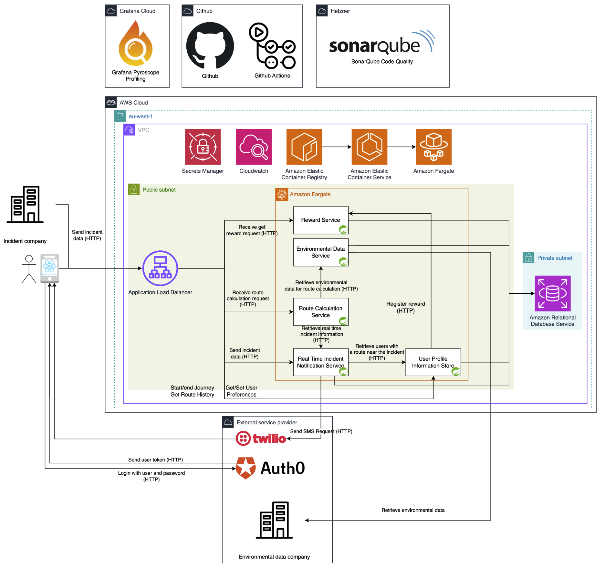
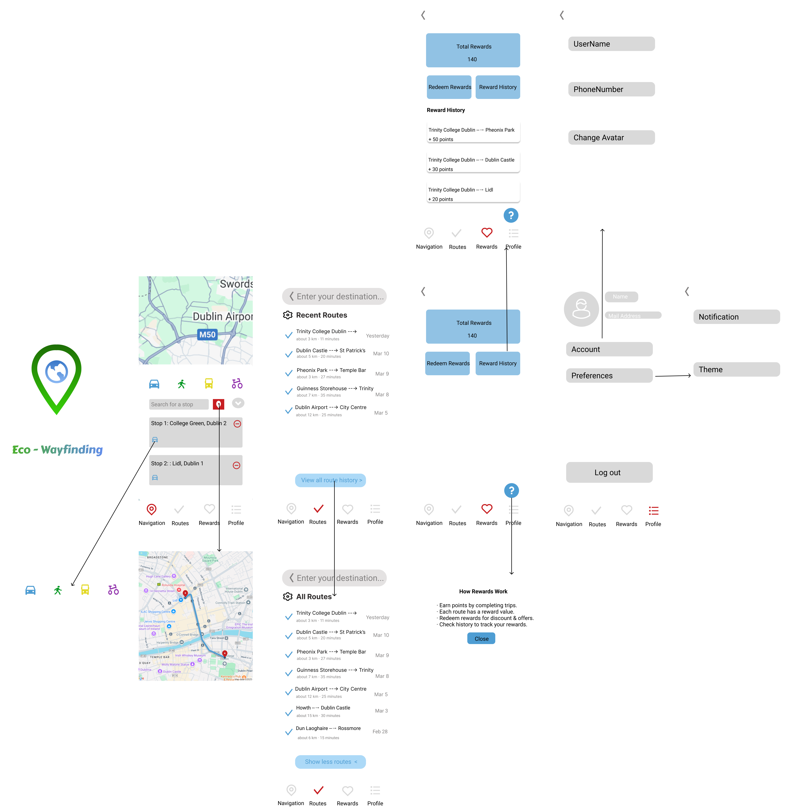

# 🚦 Dynamic Sustainable Wayfinding
*Advanced Software Engineering Final Project*

Welcome to the official landing page of our full-stack project developed for the **Advanced Software Engineering** course. This project addresses the challenge of sustainable urban travel by providing intelligent, eco-aware navigation options.

---

## 🌍 Overview

**Dynamic Sustainable Wayfinding** is a cross-platform system that guides users in real-time across multiple transport modes while prioritizing environmental sustainability. It integrates real-time air quality data, incident alerts, and user preferences to generate adaptive, optimized routes for urban mobility.

---

## 🧩 Project Structure

This system is composed of independently developed and maintained services:

- **Frontend**  
  A React Native mobile application for user interaction and route display.  
  🔗 [dsw-frontend](https://github.com/ASE-group10/dsw-frontend)

- **Backend**  
  A Spring Boot-based microservices architecture handling routing, user preferences, rewards, and external integrations.  
  🔗 [dsw-backend](https://github.com/ASE-group10/dsw-backend)

---

## ⚙️ Key Features

- 🚴 Multi-modal routing (bike, walk, bus, car)
- 🌫️ Environmentally optimized routes using real-time AQI data
- 📱 SMS alerts for real-time incidents (via Twilio)
- 🎯 Route rewards system for sustainable behavior
- ⚙️ Preferences & user profile service with Auth0 integration
---

## 🏗️ Architecture Diagram

> Our system follows a **microservices architecture** deployed using **Docker** on **AWS ECS**. Each major function (routing, user profile, reward handling, etc.) is encapsulated in its own service.

- **User authentication** is managed via Auth0 and handled by the User Profile service.
- **Routing decisions** are influenced by real-time environmental data (via OpenWeather).
- **Incidents** are fetched from external providers and users are notified via **Twilio SMS**.
- **Secrets and environment variables** are securely stored and accessed via AWS Secrets Manager.
- Logging and monitoring are handled using **AWS CloudWatch**, ensuring observability across the system.

---

## 🎨 UI Mockups

Here’s a preview of our mobile app’s user interface, designed in Figma to ensure a smooth and intuitive experience:

> The design focuses on usability and clarity, supporting route selection, incident alerts, and environmentally friendly travel choices.

---
## 📦 Tech Stack

- **Frontend**: React Native, TypeScript, Ignite CLI
- **Backend**: Spring Boot, PostgreSQL, REST APIs, Java
- **Infrastructure**: Docker, AWS ECS, Secrets Manager, Twilio, CloudWatch, Pulumi

---

## 👥 Team Members

- Zhaocun Sun
- [Add your teammates here]

---

Thank you for visiting! 🌱  
This project is part of our academic commitment to building smarter, greener cities.
